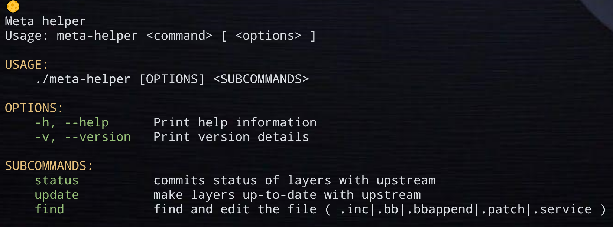

# 🛠️ Meta-Helper

**Meta-Helper** is a versatile command-line tool designed to streamline workflows in Yocto-based development environments. With features like intelligent recipe searching, editing, and automated tasks, Meta-Helper is here to save time and improve productivity.

---

### The directory layout assumed by meta-helper

The infrastructure adopted by **meta-helper** assumes the following directory layout:

```
<project>
    |──.git
    |──.gitmodules
    |──<build dir>
    |──setup-environment
    |──sources
    |    |──<meta-layer1>
    |    |──<meta-layer2>
    |    |──<meta-layer3>
    |    └──<meta-layer4>
    |──poky
    └──meta-openembedded
```

`<project>` is the root directory of the project you'll be working on.
In it you'll initially find a `setup-environment` script, which is
supposed to be source'd to set up the environment and will create
`<build dir>`, and a `sources` directory, under which the source code
of all projects (git repositories as submodules) will be stored.

The directory layout in the `<build dir>` directory follows the
standard layout as determined by the Yocto Project.

---

## 🚀 Features

- **Layer status**: Quickly checks the layer is up-to-date with upstream repo or not.
- **Interactive Search**: Quickly find and filter recipes in your Yocto `sources` directory with flexible patterns.
- **Editor Integration**: Edit files directly in your favorite editor (`nvim`, `vim`, or any editor configured in `$EDITOR`).
- **Spinner Animation**: Enjoy a sleek, animated loading spinner while tasks are running in the background.
- **Error Handling**: Comprehensive error detection and user-friendly messages for seamless operation.
- **oelint-adv parsing**: Added support to run oelint-adv linter and quickly fix some common errors for specified recipe.

---

## 📦 Installation

Download the script directly:
```bash
curl -o meta-helper https://raw.githubusercontent.com/prashantdivate/meta-helper/master/meta-helper
```
```bash
chmod +x meta-helper
```
```bash
./meta-helper
```

## 💻 Usage




## 🔧 Configuration
### Set the Default Editor
Meta-Helper uses `nvim` as the default editor. To change this, set the `EDITOR` environment variable to your preferred editor:

```bash
export EDITOR=vim
```
### Customize Search Patterns
Modify the script's find_files function to adjust the search logic or file patterns based on your needs.

## 🎨 Demo
1. Layer status \


2. finding file/recipe/patch/systemd-service
```
🌕 finding the file
[0] /home/prashant/test/recipes-connectivity/mosquitto-plugin/mosquitto-plugin.bb
[1] /home/prashant/test/recipes-connectivity/mosquitto/mosquitto_%.bbappend

Option (ENTER to cancel): 1

[v] View
[e] Edit
[o] Run oelint-adv
Option (ENTER to cancel): e
🌕 working...
```

## 📋 Requirements
- Python 3.6 or higher
- Modules: `subprocess`, `threading` (both included in Python standard library).
## 🛡️ License
**Meta-Helper** is open-sourced under the MIT License.

## 🤝 Contributing
We welcome contributions to improve **Meta-Helper!** Feel free to fork the repository, create a branch, and submit a pull request.

Guidelines
- Test all changes before submission.
- Update documentation if adding new features.

### Enjoy using Meta-Helper! 😊


